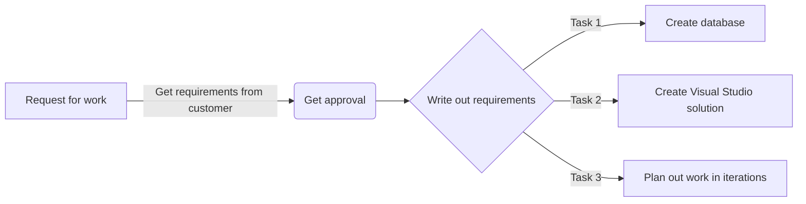
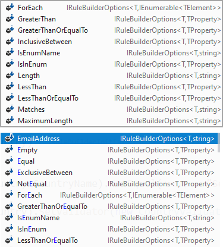
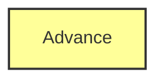
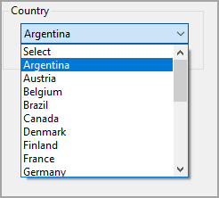
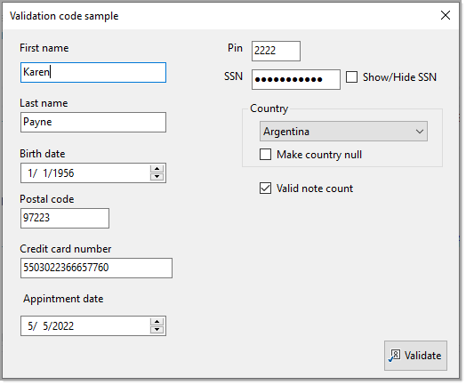
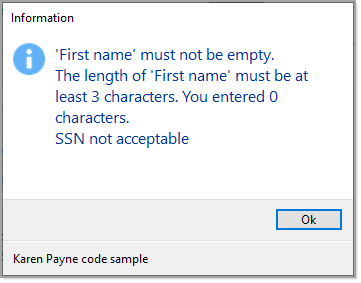

# Validating application data with Fluent Validation

Validation is the first and most important step in securing an application. It prevents the application from processing unwanted inputs that may produce unpredictable results. Couple validation with properly transmitting data to a data source.

When validating data should there be instant feedback? This is subjective, instant feedback will be better when there are many inputs so this would be better than waiting to submit their input. In the case of instant feedback there needs to be events triggered to perform validation while on submit there is a central generic method to perform validation.

Let's take another view of validating on submit, with all types of application which can be created with Visual Studio there are methods which permit displaying messages to assist the user to correct mistakes. So back to subjective, it may come down to if code is written in a team or individual in regards to, are there team rules or it's the Wild West.

## Preface


- This repository contains validation code samples for user input, not validation of data coming from a database or other external sources, for working with databases and external sources that deserves it's own article.
- Focus is on [Fluent Validation](https://docs.fluentvalidation.net/en/latest/installation.html) is a validation library for .NET, used for building strongly typed validation rules for business objects. Fluent validations use a Fluent interface and lambda expressions to build validation rules.
- For working with Data Annotations see [Class/model validation basics](http://example.com) for web and desktop which focuses on data annotations with several examples also on Fluent Validation while this article has more advance FluentValidation examples.

# Basics



First figure out `models` (classes) needed for an application followed by writing out `business rules`. For instance, for a customer model a simple example of a rule, a property name `FirstName` is `required`, must be `at least three characters` and `less than ten characters` and a property named `BirthDate` cannot be `less than year 1932` and not `greater than 2021` are some examples of rules.

Let's look at FirstName, 

Data annotations, the StringLength attribute denotes min and max length while Required attribute indicates that first name can't be empty.

```csharp
[Required]
[StringLength(10, MinimumLength = 3)]
public string FirstName { get; set; }
```

**Fluent Validation** there are no attributes

[Fluent Validation home page](https://docs.fluentvalidation.net/en/latest/index.html)

```csharp
public string FirstName { get; set; }
```

Instead rules are setup in a validator class which inherits [AbstractValidator](https://github.com/FluentValidation/FluentValidation/blob/main/src/FluentValidation/AbstractValidator.cs)&lt;T&gt;. In the case of our [Customer](https://github.com/karenpayneoregon/teaching-simple-validation/blob/master/FluentValidationLibrary/Models/Customer.cs) model, FirstName

```csharp
    public class CustomerValidator : AbstractValidator<Customer>
    {
        public CustomerValidator()
        {
            var settings = SettingsOperations.ReadCustomerSettings();

            RuleFor(customer => customer.FirstName)
                .NotEmpty()
                .MinimumLength(settings.FirstNameSettings.MinimumLength)
                .MaximumLength(settings.FirstNameSettings.MaximumLength)
                .WithName(settings.FirstNameSettings.WithName);

```

In the above, `settings` reads min, max length from a json file and could also be from a database while with data annotations this is not possible out of the box.

The json file for above.

```json
{
  "FirstNameSettings": {
    "MinimumLength": 3,
    "MaximumLength": 10,
    "WithName": "First name"
  },
  "LastNameSettings": {
    "MinimumLength": 5,
    "MaximumLength": 30,
    "WithName": "Last name"
  }
}
```

Using a data source as in the above json, this means min, max length and `WithName` (allows a developer to use an alternate name for the property name, in this case FirstName and LastName.

## Rules

To specify a validation rule for a particular property, call the `RuleFor`[^rulefor] method, passing a lambda expression that indicates the property that you wish to validate. 

Simple example

```csharp
public class CustomerValidator : AbstractValidator<Customer>
{
  public CustomerValidator()
  {
    RuleFor(customer => customer.FirstName).NotNull();
  }
}
```

Here are some of the built in rules.



There are cases were these will not suit all business rules so a developer can create their own.

Perhaps a Date can not be on a weekend. In the following, [IsNotWeekend()](https://github.com/karenpayneoregon/teaching-simple-validation/blob/master/FluentValidationLibrary/Extensions/ValidatingHelpers.cs#L88:L92) is a language extension.

```csharp
RuleFor(customer => customer.AppointmentDate)
    .Must(dateTime => dateTime.IsNotWeekend())
    .WithName("Appointment date")
    .WithMessage("We are not open on weekends");
```
In other cases a custom validator may be needed, in this case to ensure a list property is not null.

```csharp
public class CountryValidator : AbstractValidator<Country>
{
    public CountryValidator()
    {
        RuleFor(country => country).NotNull();
    }
}
```

**Usage**

```csharp
RuleFor(customer => customer.Country).SetValidator(new CountryValidator());
```

## PreValidation



PreValidate[^prevalidate]  Suppose there may be a case where the instance of a model might be null, simply override PreValidate event.

```csharp
protected override bool PreValidate(ValidationContext<Customer> context, ValidationResult result)
{
    if (context.InstanceToValidate is null)
    {
        result.Errors.Add(new ValidationFailure("", $"Dude, must have a none null instance of {nameof(Customer)}"));
        return false;
    }

    return true;
}
```

## Override property name

In the case of `FirstName` which great for a developer, not the case for a user so use .WithName("First name")

## Dropdown selections

For adding a new instance of your model, many times a developer will have a `Select` option to have the user pick a selection.



Simple create a rule. Yes the `NotEqual` is hard-wired but as with using a json file for FirstName and LastName we can add this into in the case you  don't want to use `Select`, perhaps 'Choice`.

```csharp
RuleFor(customer => customer.Country.CountryName)
    .NotEqual("Select")
    .WithMessage("Please select a country");
```


## Windows Forms Playground

There is a Windows form application which will allow testing rules visually.




## Unit test 

Also included is a unit test project to play around and learn working with FluentValidation.

## Performing validation

No matter if it's a Windows Form, WPF, ASP.NET or unit test the following shows how to invoke a validator.

```csharp
_customerValidator = new CustomerValidator();

// perform validation
ValidationResult result = _customerValidator.Validate(customer);

if (result.IsValid)
{
    Operations.UpdateCustomer(customer);
}
```

If you want to see the error messages if any use [PresentErrorMessage](https://github.com/karenpayneoregon/teaching-simple-validation/blob/master/FluentValidationLibrary/Extensions/ValidatingHelpers.cs#L74:L86) and to simply display any error messages to Visual Studio output window use [ShowErrorMessage](https://github.com/karenpayneoregon/teaching-simple-validation/blob/master/FluentValidationLibrary/Extensions/ValidatingHelpers.cs#L66:L69).

```csharp
_customerValidator = new CustomerValidator();

// perform validation
ValidationResult result = _customerValidator.Validate(customer);

Dialogs.Information(result.PresentErrorMessage());
```

# Dialogs

Rather than use conventional MessageBox.Show, I've used TaskDialog in the [following project](https://github.com/karenpayneoregon/teaching-simple-validation/tree/master/WindowsFormsLibrary).



The footer can easily be customized or removed.

See the following [repository](https://github.com/karenpayneoregon/task-dialog-csharp) dedicated to TaskDialog.

# Related

[FluentValidation tips](https://github.com/karenpayneoregon/fluent-validation-tips) written with Microsoft Visual Studio 2022 17.4.x

# Summary

Using FluentValidation is one way to perform validation, may or may not be right for every developer, some may want to use data annotations or a third party library like [Postsharp](https://www.postsharp.net/).

Only you can make the choice which to use but choice one of these rather than hand write code to validate each property in a class or worst in a form.


[^rulefor]: The `.RuleFor` method on the Validator class is used to build up rule chains for properties on your model.

[^prevalidate]: If you need to run specific code every time a validator is invoked, you can do this by overriding the PreValidate method. This method takes a `ValidationContext` as well as a `ValidationResult`, which you can use to customise the validation process.
